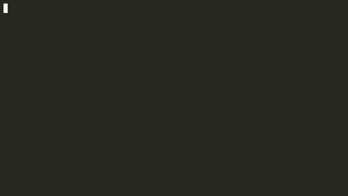

# Console App Skeleton #

### Concept ###
Using differences tasks to handle commands. When watch command executed that will actived two tasks to listen key event and rendering logs. After terminate watch log and litenn key task that will reactivated main prompt task to handle command input.

### Pacages ###
-  `McMaster.Extensions.CommandLineUtils` to parse command arguments.
- `BetterConsoleTables` to display tables.
- `ReadLine` to prompt command.
